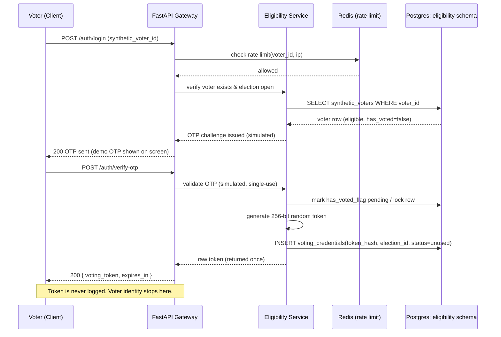
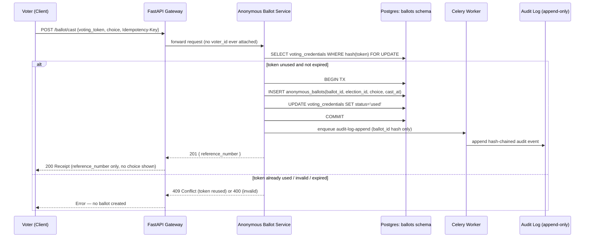
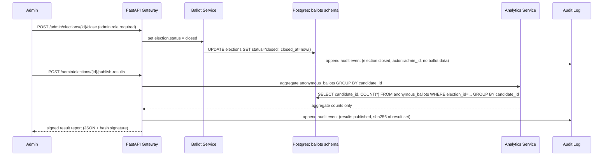
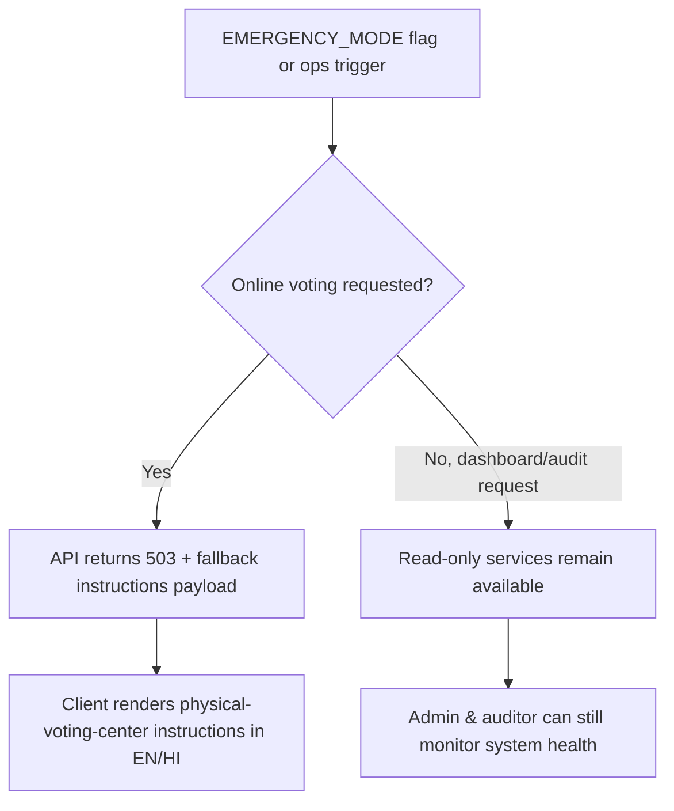

# Data-Flow Diagrams

## 1. Voter Registration → Voting Credential Issuance

## 2. Anonymous Ballot Casting

## 3. Administrator: Close Election & Publish Results

## 4. Emergency Fallback Trigger

